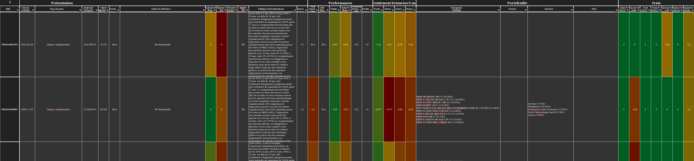

# allocation-actifs

Script python qui génère un fichier Excel permettant de comparer différents fonds d'investissement *BNP Paribas* à partir d'une liste d'ISIN ou, le cas échéant, tous les fonds *BNP Paribas* disponibles.

> :warning:
> L'utilisation et le code source de cet outil est fourni avec la licence ["GNU GENERAL PUBLIC LICENSE version 3"](./LICENSE) (en anglais).
Comme mentionné dans l'article 15 de la licence, cet outil est fourni tel quel et le développeur décline toute responsabilité en cas d'information erronée ou manquante qui viendrait à tromper l'utilisateur dans son choix d'investissement.
<!-- markdownlint-disable MD0128 -->
> :warning:
> L'utilisateur de ce script est responsable de l'extraction des données qui sont faites depuis:
>
> - l'API publique REST *BNP Paribas Asset Management* depuis le endpoint <https://api.bnpparibas-am.com>
> - le site web <https://www.quantalys.com>.
>
> Le développeur de se script ne peut être tenu responsable par l'utilisateur si l'un de ces services tiers juge l'utilisation de ce script frauduleuse. Veuillez lire les mentions légales de ces 2 services tiers avant d'utiliser ce script.

Voici un aperçu du fichier Excel généré:

